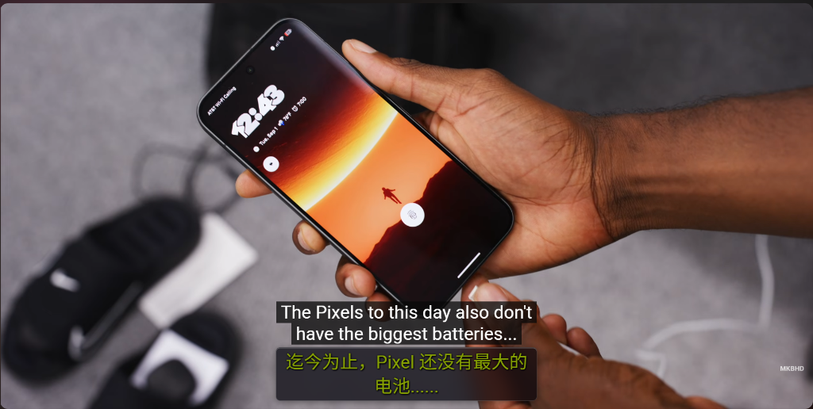
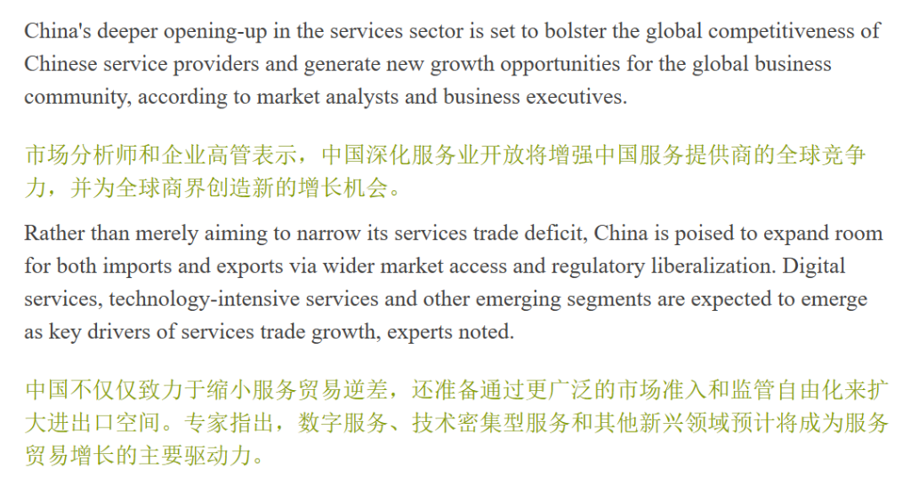

<div align="right">
  <a href="README.md">English</a> | <strong><a href="README_zh.md">简体中文</a></strong>
</div>

# HoldTranslate Web

HoldTranslate Chrome 沉浸式翻译扩展官方介绍与交互体验落地页，秉承 Apple Liquid Glass 流体毛玻璃设计美学！

> **超快速提醒：**  
> 本项目是 **HoldTranslate** 的官方产品展示落地页与实时交互工坊。全面基于 Next.js 15、Tailwind CSS 以及源自 [`rdev/liquid-glass-react`](https://github.com/rdev/liquid-glass-react) 的 Apple Liquid Glass 光学折射着色器体系构建。访问者无需安装任何插件，即可在浏览器中真实体验长按网页翻译、调节控制中枢面板与查看 YouTube 0ms 预加载字幕。

[](https://vercel.com)
[](https://egggggod.github.io/HoldTranslate-web/)
[](https://nextjs.org/)
[](https://tailwindcss.com/)
[](https://github.com/egggggod/HoldTranslate-web/actions)
[](LICENSE)

[](https://vercel.com/new/clone?repository-url=https%3A%2F%2Fgithub.com%2Fegggggod%2FHoldTranslate-web)

## 演示

> 完美响应式适配现代 Chromium 内核桌面浏览器（Chrome、Edge、Brave 等），具备完整的 WebGL 与 SVG 置换着色器硬件加速能力。

- **Vercel 全球边缘节点（推荐访问）**：[https://holdtranslate-web.vercel.app](https://holdtranslate-web.vercel.app) *(或您的 Vercel 项目绑定域名)*
- **GitHub Pages 静态镜像**：[https://egggggod.github.io/HoldTranslate-web/](https://egggggod.github.io/HoldTranslate-web/)

### 1. 流体毛玻璃控制中枢与长按模拟器


### 2. 高对比度浅色与深色模式双主题呈现


## 概述

本项目由三大核心技术支柱构建：

1. **Apple VisionOS 流体毛玻璃引擎**：忠实复刻 `rdev/liquid-glass-react` 的光学置换着色器、RGB 色散通道与基于物理的光标弹性形变，呈现真实的晶体透光与折射质感。
2. **双模实时交互工作坊**：内置高保真网页模拟视窗，用户可在科技资讯、视频标题及学术论文上真实按住鼠标左键（~500ms 触发缓冲），直观体验双语字幕滑入与复原，右侧无缝衔接 1:1 还原的毛玻璃设置中枢。
3. **双环境智能自适应架构**：在 **Vercel** 托管环境下自动启用 Next.js 原生模式与根路径 `/`，享受全球边缘网络（Edge CDN）极速分发与图像优化；在 **GitHub Pages** 下自动回退至纯静态导出（`output: 'export'`）与仓库子路径。

## 项目结构

```bash
HoldTranslate-web/
├── .github/
│   └── workflows/
│       └── deploy.yml          # GitHub Pages 自动化 CI/CD 构建工作流
├── public/
│   ├── assets/                 # 高清展示效果图
│   │   ├── demo-light.png
│   │   ├── demo-dark.png
│   │   └── demo-subtitles.png
│   ├── icons/                  # HoldTranslate 图标文件 (16, 48, 128)
│   └── download/               # 扩展离线打包安装包 (.zip)
├── src/
│   ├── components/
│   │   ├── LiquidGlass/        # Liquid Glass 折射组件与 Shader 着色器生成器
│   │   │   ├── index.tsx       # LiquidGlass 核心组件包装与 SVG 置换滤镜
│   │   │   ├── shader-utils.ts # WebGL/Canvas 着色器算法生成器
│   │   │   └── utils.ts        # SVG 置换位图数据 (Standard/Polar/Prominent)
│   │   ├── Navbar.tsx          # 顶部流体玻璃悬浮岛导航栏
│   │   ├── Hero.tsx            # 主视觉展示区与极光光环背景
│   │   ├── InteractiveDemo.tsx # 真实长按翻译模拟器 + 1:1 弹窗设置中枢
│   │   ├── FeatureGrid.tsx     # 六大工程支柱 Bento 晶体卡片
│   │   ├── SubtitleShowcase.tsx# YouTube 双语字幕深度适配演示
│   │   ├── QuickInstall.tsx    # 60 秒极简分步安装指引
│   │   └── Footer.tsx          # Thinking-Claude 规范页脚
│   ├── locales/
│   │   ├── en.ts               # 英文完整语料字典
│   │   └── zh.ts               # 简体中文完整语料字典
│   ├── pages/
│   │   ├── _app.tsx            # Next.js 应用入口
│   │   ├── _document.tsx       # HTML 文档与元数据注入
│   │   └── index.tsx           # 主落地页面入口
│   └── styles/
│       └── globals.css         # Tailwind v4 指令与极光流体动画
├── vercel.json                 # Vercel 生产级安全标头与长期缓存配置
├── next.config.ts              # 智能双环境 (Vercel / GitHub Pages) 构建配置
├── postcss.config.mjs          # PostCSS 与 Tailwind PostCSS 插件配置
├── tsconfig.json               # TypeScript 严苛模式配置
├── package.json                # 项目依赖与 npm 脚本配置
├── README.md                   # 英文说明文档
└── README_zh.md                # 中文说明文档 (简体中文)
```

整个工程无任何后端服务器依赖，导出的静态文件可直接零配置托管于 GitHub Pages、Cloudflare Pages 或 Vercel。

## 特性

- ⚡ **纯正 Apple 流体毛玻璃折射**：支持多种折射模式（`standard`、`polar`、`prominent`、`shader`）、色散分离与光标吸附弹性。
- 🎯 **真实交互长按沙盒**：访问者可按住任意段落，直观体验环形进度条、双语字幕滑入以及二次长按优雅复原。
- 🌐 **无感中英双语即时切换**：全站所有标题、交互卡片与按钮文案均支持中英双语瞬时置换。
- 🎨 **全局主题色联动控制**：点击 6 款苹果经典调色盘圆环，全站流光、激活光晕与卡片边框色彩即时响应。
- 📱 **1:1 插件设置中枢**：高精度模拟 HoldTranslate 扩展的实际弹窗，支持切换 Google / 微软 / DeepSeek / 自定义 API 引擎与字幕模式。
- 🚀 **一键 Vercel 极速部署**：支持在 Vercel 上一键部署或通过 GitHub Actions 部署至 GitHub Pages。

## Vercel 一分钟托管指引

将 HoldTranslate-web 部署至 Vercel 仅需 60 秒：

1. **方式一：一键点击部署按钮**
   - 点击上方 **[Deploy with Vercel](https://vercel.com/new/clone?repository-url=https%3A%2F%2Fgithub.com%2Fegggggod%2FHoldTranslate-web)** 按钮。
   - 授权 GitHub 账户，确认项目名称后点击 **Deploy** 即可。

2. **方式二：在 Vercel 控制台导入**
   - 打开 [vercel.com/new](https://vercel.com/new)。
   - 在 **Import Git Repository** 列表中找到并选择 `egggggod/HoldTranslate-web`。
   - 框架预设保持为 **Next.js**（默认自动识别）。
   - 点击 **Deploy**！之后每次向 `main` 分支执行 `git push`，Vercel 都会自动触发全球边缘极速部署。

3. **方式三：Vercel CLI 命令行直接发布**
   ```bash
   npx vercel
   # 生产环境发布：
   npx vercel --prod
   ```

## HoldTranslate 扩展上手指南

在访问介绍网页后，只需 4 步即可装入 Chrome：

1. 点击顶部导航栏的 **「下载 v1.7.0」** 按钮。
2. 解压下载的 `.zip` 压缩包。
3. 在 Chrome 浏览器打开 `chrome://extensions/` 并开启右上角 **「开发者模式」**。
4. 点击左上角 **「加载已解压的扩展程序」** 并选择解压文件夹。
5. 大功告成！在任意网页长按文本即可体验纯粹的双语阅读流。

## 为什么选择 HoldTranslate？

- **归真阅读**：无巨型卡片、无弹窗遮挡、无广告水印，专注文本本身。
- **排版和谐**：100% 镜像继承页面字体、字重与字阶比例，译文浑然天成。
- **多元引擎**：自由选择免密公共翻译或前沿大模型深度推理翻译。
- **轻量私密**：纯原生 JavaScript 实现，零外部依赖，不收集任何用户隐私。

## 更新日志

欲查看详细的版本更新历史与变更说明，请访问我们的 **[GitHub Releases](https://github.com/egggggod/HoldTranslate-plugin-for-chrome/releases)** 页面。

## 参与贡献

热烈欢迎各种形式的贡献与建议！你可以：

- 通过 [GitHub Issues](https://github.com/egggggod/HoldTranslate-web/issues) 提交使用反馈或功能创意
- 提出 UI/UX 设计优化建议或丰富交互演示组件
- 提交 Pull Request 共同改进

## 开源协议

本项目采用 MIT 协议开源。

## 致谢

- 感谢 **[`rdev/liquid-glass-react`](https://github.com/rdev/liquid-glass-react)** 带来的突破性 Apple 流体毛玻璃折射着色器实现。
- 感谢 **Google DeepMind & Gemini 3.8 Flash** 提供的全面代码结对协作支持。
